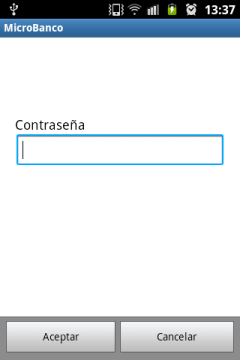
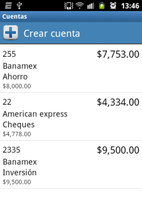
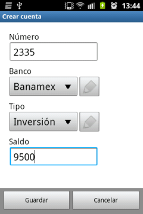
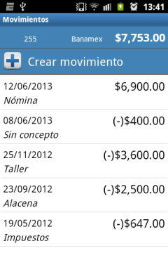
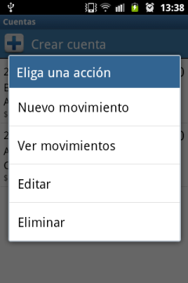
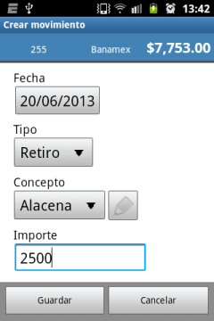
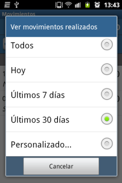
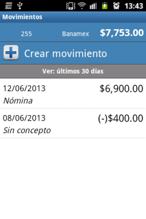
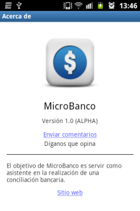

# MicroBanco

MicroBanco es una aplicación para teléfonos inteligentes (Smartphones) con el sistema operativo Android (v1.6 en adelante), tiene como objetivo servir como asistente en la realización de una conciliación bancaria.

Realice las operaciones financieras en su dispositivo Android para llevar un seguimiento del estado de sus cuentas bancarias.

[MicroBanco en Google Play](https://play.google.com/store/apps/details?id=clases.microbanco)

## Características principales

- Inicio de sesión protegido con contraseña.
- Saldo inicial y saldo actual de la cuenta.
- Movimientos con fecha, concepto e importe.
- Filtro de movimientos por periodo de tiempo determinado.
- Posibilidad de añadir bancos, tipos de cuenta y conceptos.

  
  
  

## Autor

Felipe Romero

## Licencia

Copyright 2018 Felipe Romero

Licensed under the Apache License, Version 2.0 (the "License");
you may not use this file except in compliance with the License.
You may obtain a copy of the License at

   http://www.apache.org/licenses/LICENSE-2.0

Unless required by applicable law or agreed to in writing, software
distributed under the License is distributed on an "AS IS" BASIS,
WITHOUT WARRANTIES OR CONDITIONS OF ANY KIND, either express or implied.
See the License for the specific language governing permissions and
limitations under the License.
